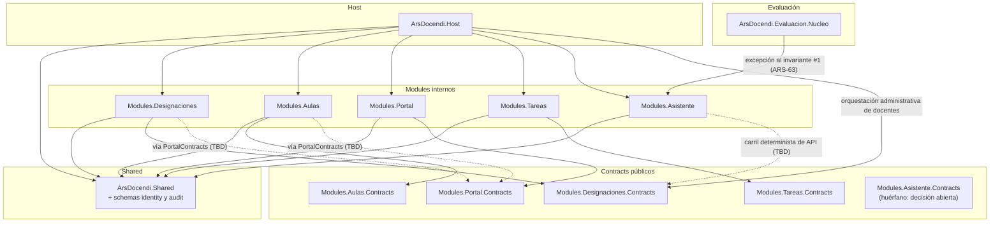

# Dependency graph

**Reglas**: grafo dirigido acíclico (DAG). Los módulos solo dependen de `ArsDocendi.Shared` y de los `Modules.*.Contracts` que necesiten. Módulo → módulo **solo** vía `.Contracts`.

`ArsDocendi.Shared` hospeda además la persistencia de `identity` y `audit` (invariante #4 enmendado), así que suma dependencias de **paquete** — EF Core y Npgsql — pero ninguna de proyecto: el grafo entre proyectos no cambia. La contrapartida es que todos los módulos alcanzan `identity` sin pasar por Contracts; ver "Frontera de lectura sobre identity" más abajo.

## La lista de aristas vive en el manifiesto

La declaración única de las aristas es [`backend/manifiesto-de-aristas.json`](../../backend/manifiesto-de-aristas.json). Enumera todo proyecto de `backend/src` y toda referencia de proyecto real, cada una con el motivo por el que existe.

`ManifiestoDeAristasTests` lo compara contra los `ProjectReference` de verdad y falla en tres direcciones: arista en el código sin fila, fila sin arista en el código, y proyecto sin clasificar. `AciclicidadDelGrafoTests` comprueba el invariante #2 sobre las aristas leídas del código.

**Este documento no repite esa lista a propósito.** Antes tenía una tabla —el «Edge registry»— que ningún test leía, y que acumuló las tres desviaciones posibles: dos aristas reales sin fila y una fila que ningún `.csproj` referenciaba. Una segunda lista solo puede coincidir con la primera o mentir, y la que miente es siempre la que un lector encuentra primero.

Lo que sí vive acá es la prosa que explica el grafo: por qué las fronteras están donde están.

## Diagrama

> **Dibujo de orientación, no normativo.** Sirve para ubicarse; no lo verifica ningún test y puede desincronizarse. La lista verificada es el manifiesto.

Líneas punteadas: dependencias cross-module **proyectadas**, que hoy no existen en ningún `.csproj`. No tienen fila en el manifiesto y no pueden tenerla: una fila existe cuando la referencia existe. Cuando se confirmen, pasan a sólidas y entran al manifiesto en el mismo PR que el `ProjectReference`.

Dependencias de **paquete** de `ArsDocendi.Shared` (no son aristas del grafo de proyectos y quedan fuera del manifiesto, pero explican por qué Shared ya no es puro):

| Paquete                                    | Razón                                              |
| ------------------------------------------ | -------------------------------------------------- |
| `Microsoft.EntityFrameworkCore`            | `IdentityDbContext` — schemas `identity` y `audit` |
| `Microsoft.EntityFrameworkCore.Relational` | `AuditDbConnectionInterceptor`                     |
| `Npgsql.EntityFrameworkCore.PostgreSQL`    | Provider de PostgreSQL para ese contexto           |

## Frontera de lectura sobre `identity`

Los 4 módulos referencian `ArsDocendi.Shared`, y desde este change eso les da alcance directo a `identity`. El invariante #1 **no** cubre este caso: no es una relación cross-module, porque referenciar Shared es legítimo para todos.

La disciplina, corolario del invariante #4 enmendado:

- Los módulos **leen** `identity` para autorizar, y lo hacen a través de `IConsultasIdentity` — una interfaz sólo de lectura, que existe precisamente para que escribir sea incómodo aunque el `DbContext` esté al alcance.
- Escribir `personas`, `roles`, `permisos` o `rol_permisos` es **exclusivo de la superficie de administración**.

`/pr-review` y `/architecture-drift-check` deben tratar cualquier escritura a identity desde un `Modules.*` como violación. `ArquitecturaIdentityTests` verifica automáticamente la frontera Controller → Service → Repository, la escritura administrativa exclusiva y que ningún proyecto **de módulo** consuma internals de otro módulo; su glob es `Modules.*.csproj`, así que las aristas de los proyectos que no son módulos las cubre el manifiesto.

## Orquestación administrativa de docentes

`ArsDocendi.Host.Administracion.ServicioDocentes` coordina la identidad canónica con las asignaciones vigentes. Para la parte de Designaciones depende sólo de `IAdministracionDesignaciones` y sus DTOs en `Modules.Designaciones.Contracts`; la implementación queda dentro de `Modules.Designaciones`. Este camino usa la arista Host → Contracts ya registrada y no agrega Designaciones → Host ni Shared → módulo, por lo que el grafo continúa acíclico.

**Aristas cross-module proyectadas** (a confirmar en la spec respectiva, sin fila en el manifiesto hasta que el `.csproj` las referencie): `Modules.Designaciones` → `Modules.Portal.Contracts`, para validar que el docente designado existe en el portal; `Modules.Aulas` → `Modules.Portal.Contracts`, para conocer al docente solicitante de la reserva; y `Modules.Asistente` → `Modules.Designaciones.Contracts`, que llega con el carril determinista de API (ARS-46).

## Agregar una arista nueva

1. Confirmar que **no genera ciclo**. `AciclicidadDelGrafoTests` lo verifica sobre el código, así que el ciclo aparece en rojo apenas se escribe el `ProjectReference`.
2. Implementar usando **import de Contracts + DI**, nunca el proyecto interno de otro módulo.
3. Agregar la fila a [`backend/manifiesto-de-aristas.json`](../../backend/manifiesto-de-aristas.json) **en el mismo PR** que el `.csproj`: `origen`, `destino`, `via` y `motivo` son obligatorios, y la vía tiene que pertenecer al vocabulario que el verificador sabe comprobar. Sin la fila, el test se pone en rojo.
4. Si la arista **excede un invariante**, declararla como excepción en su propia fila, con el `invariante` que excede y el `ticket` que la aprobó. El test exige las dos cosas más el motivo: una excepción no se documenta en prosa, y ampararse en una excepción ya aprobada no alcanza —cada arista necesita su propia fila.
5. Actualizar el diagrama Mermaid si ayuda a orientarse. Es un dibujo, no el registro.
6. En el PR, el motivo de la arista ya está escrito en la fila; alcanza con lincarla.
