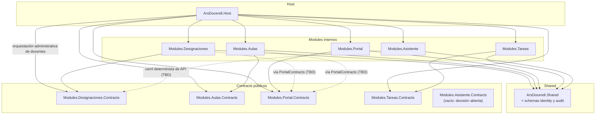

# Dependency graph

**Reglas**: grafo dirigido acíclico (DAG). Los módulos solo dependen de `ArsDocendi.Shared` y de los `Modules.*.Contracts` que necesiten. Módulo → módulo **solo** vía `.Contracts`.

`ArsDocendi.Shared` hospeda además la persistencia de `identity` y `audit` (invariante #4 enmendado), así que suma dependencias de **paquete** — EF Core y Npgsql — pero ninguna de proyecto: el grafo entre proyectos no cambia. La contrapartida es que todos los módulos alcanzan `identity` sin pasar por Contracts; ver "Frontera de lectura sobre identity" más abajo.

## Diagrama

Líneas punteadas: dependencias cross-module proyectadas (no confirmadas todavía). Cuando se confirmen, pasan a sólidas y se agregan al edge registry.

## Edge registry

| From                    | To                                      | Vía               | Notas                                                                                              |
| ----------------------- | --------------------------------------- | ----------------- | -------------------------------------------------------------------------------------------------- |
| `ArsDocendi.Host`       | `Modules.Designaciones`                 | project reference | Hosting + composition root                                                                         |
| `ArsDocendi.Host`       | `Modules.Aulas`                         | project reference | Hosting                                                                                            |
| `ArsDocendi.Host`       | `Modules.Portal`                        | project reference | Hosting                                                                                            |
| `ArsDocendi.Host`       | `Modules.Tareas`                        | project reference | Hosting                                                                                            |
| `ArsDocendi.Host`       | `Modules.Designaciones.Contracts`       | project reference | `IAdministracionDesignaciones`: consulta y reemplazo de designaciones vigentes sin tocar internals |
| `ArsDocendi.Host`       | `Modules.Aulas/Portal/Tareas.Contracts` | project reference | DI / interfaces de composición                                                                     |
| `Modules.Designaciones` | `ArsDocendi.Shared`                     | project reference | Utilidades                                                                                         |
| `Modules.Designaciones` | `Modules.Designaciones.Contracts`       | project reference | Propio contract público                                                                            |
| `Modules.Aulas`         | `ArsDocendi.Shared`                     | project reference | Utilidades                                                                                         |
| `Modules.Aulas`         | `Modules.Aulas.Contracts`               | project reference | Propio contract público                                                                            |
| `Modules.Portal`        | `ArsDocendi.Shared`                     | project reference | Utilidades                                                                                         |
| `Modules.Portal`        | `Modules.Portal.Contracts`              | project reference | Propio contract público                                                                            |
| `Modules.Tareas`        | `ArsDocendi.Shared`                     | project reference | Utilidades                                                                                         |
| `Modules.Tareas`        | `Modules.Tareas.Contracts`              | project reference | Propio contract público                                                                            |
| `ArsDocendi.Host`       | `Modules.Asistente`                     | project reference | Hosting                                                                                            |
| `Modules.Asistente`     | `ArsDocendi.Shared`                     | project reference | Utilidades                                                                                         |

`Modules.Asistente.Contracts` existe en la solución pero **no aparece en el registro**: ningún proyecto lo referencia. El asistente consume Contracts ajenos y nadie lo consume a él, así que su `.Contracts` nace vacío. Se lo dejó como nodo huérfano a propósito, para que la decisión de conservarlo o borrarlo quede visible; ver `backend/src/Modules.Asistente.Contracts/README.md`.

Dependencias de paquete de `ArsDocendi.Shared` (no son edges del grafo de proyectos, pero explican por qué Shared ya no es puro):

| Paquete                                    | Razón                                              |
| ------------------------------------------ | -------------------------------------------------- |
| `Microsoft.EntityFrameworkCore`            | `IdentityDbContext` — schemas `identity` y `audit` |
| `Microsoft.EntityFrameworkCore.Relational` | `AuditDbConnectionInterceptor`                     |
| `Npgsql.EntityFrameworkCore.PostgreSQL`    | Provider de PostgreSQL para ese contexto           |

## Frontera de lectura sobre `identity`

Los 4 módulos referencian `ArsDocendi.Shared`, y desde este change eso les da alcance directo a `identity`. El invariante #1 **no** cubre este caso: no es una relación cross-module, porque referenciar Shared es legítimo para todos.

La disciplina, corolario del invariante #4 enmendado:

- Los módulos **leen** `identity` para autorizar, y lo hacen a través de `IConsultasIdentity` — una interfaz sólo de lectura, que existe precisamente para que escribir sea incómodo aunque el `DbContext` esté al alcance.
- Escribir `personas`, `roles`, `permisos` o `rol_permisos` es **exclusivo de la superficie de administración**.

`/pr-review` y `/architecture-drift-check` deben tratar cualquier escritura a identity desde un `Modules.*` como violación. `ArquitecturaIdentityTests` verifica automáticamente la frontera Controller → Service → Repository, la escritura administrativa exclusiva y que ningún proyecto consuma internals de otro módulo.

## Orquestación administrativa de docentes

`ArsDocendi.Host.Administracion.ServicioDocentes` coordina la identidad canónica con las asignaciones vigentes. Para la parte de Designaciones depende sólo de `IAdministracionDesignaciones` y sus DTOs en `Modules.Designaciones.Contracts`; la implementación queda dentro de `Modules.Designaciones`. Este camino usa el edge Host → Contracts ya permitido y no agrega Designaciones → Host ni Shared → módulo, por lo que el grafo continúa acíclico.

**Edges cross-module proyectados (a confirmar en spec respectiva)**:

| From                    | To                         | Vía             | Razón                                                |
| ----------------------- | -------------------------- | --------------- | ---------------------------------------------------- |
| `Modules.Designaciones` | `Modules.Portal.Contracts` | DI via interfaz | Validar que el docente designado existe en el portal |
| `Modules.Aulas`         | `Modules.Portal.Contracts` | DI via interfaz | Conocer el docente solicitante de la reserva         |

## Agregar un edge nuevo

1. Confirmar que **no genera ciclo** (rastrear deps transitivas).
2. Agregar fila al edge registry de arriba.
3. Implementar usando **import de Contracts + DI**, nunca proyecto interno.
4. Actualizar el diagrama Mermaid.
5. En el PR, documentar el motivo del edge.
